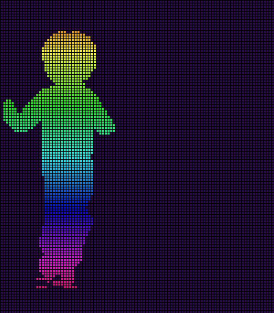

## Hello, TKH Staff - Welcome to My GitHub Page 

You can use the [editor on GitHub](https://github.com/berryq460/berryq460.github.io/edit/master/README.md) to maintain and preview the content for your website in Markdown files.

Whenever you commit to this repository, GitHub Pages will run [Jekyll](https://jekyllrb.com/) to rebuild the pages in your site, from the content in your Markdown files.

Markdown is a lightweight and easy-to-use syntax for styling your writing. It includes conventions for

3 Top Reasons why I want to be a TKH Fellow

- _Insatiable Curiosity:  Computer Science is a powerful tool that can be used to solve: from larger than life to everyday problems. I am enthralled by the intersection between natural and computer sciences and how they both together can solve complex problems in research and solves customers needs in business.
- _Necessity: Now more than ever technology and virtual world is our life line whether we are a part of it or not, it shapes our world and we should all be able to at least have some fluency in not only human languages but computer languages too. My goal is to be multilingual world traveler and coder, a citizen of the world both physical and virtual.
- _Community: I believe more people, specifically minorities, especially women of color, should have a seat at the table of shaping our virtual world , creating more accurate algorithms incorporating a more comprehensive range of world views and upbringings and utilize our right to rise above poverty to do meaningful, mentally challenging and purposeful work in technology. **I am intrigued by the positive impact computer programming can create in the world and I want to be a part of that movement that The Knowledge House is leading to empower high-need, high-potential candidates to one day be high-earning and highly-involved in the future success of the communities they come from.**

## What TKH means to me
1. Numbered
2. List

### Header 3

**Bold** and _Italic_ and `Code` text

### Contact Information

#### Thank You!

