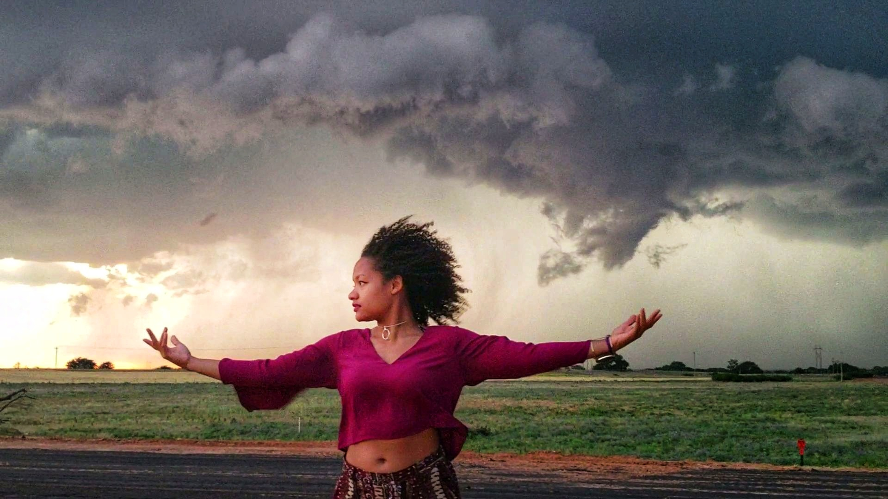
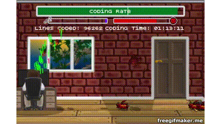

## Welcome TKH Staff ! 

 Grab a seat 
 & Get comfortable :)

## Who Am I?

My goal is to become a multilingual (in human & computer languages) citizen of the world who strives to create postive change in both the cyber and physical world. I am currently an adventurous, insatiablly curious, calculated risk-taker- whether behind a book, screen or in my solo backpacking adventures.

**3 Top Reasons why I want to be a TKH Innovation Fellow**

* Purpose over Paycheck:

 

I believe *no amount of money will make a person permanetly happy*. What draws me to tech is the potential to provide service to society through solving problems and creating something that can last long after my time. Computer Science and technolgy are powerful tools that can be used to solve problems ranging from larger-than-life to repetitive everyday problems. I am enthralled by the intersection between natural and computer sciences and how these sciences can compliment one another- from solving complex problems in research to solving customers needs in business or biotechnology.

 * Eager to Contribute to Society and Willing to Put in the Work (to develop my technical skillset):
 
 

I have always been passionate about technology but now I feel a special sense of urgency to get involved, especially with how tech has become our life-line in a time of crisis. I believe coding languages, like human ones, are fundamental and should be taught starting in all grammer schools. My philosophy is : whether we are a part of the technological movement or not, tech shapes our world. We all need to do our part in educating ourselves and eachother about it. I am determined to do whatever it takes to do my part and then some.

 * Vision to be a Leader within the Tech Field:

I believe more people, especially minority women, should have a seat at the table of shaping our virtual world, creating more accurate algorithms by incorporating a more comprehensive range of world views. I believe we must excercise our right to rise above poverty. We must work hard to do meaningful and mentally challenging work in technology and we must work smart while changing the face of tech together.

**I am inspired by the positive impact technology can create in the world when used correctly. The Knowledge House community and its programs are a perfect example of this. I want to contribute to the movement that The Knowledge House is leading to empower high-need, high-potential candidates to one day be high-earning and highly-involved in the future success of the communities they come from.**

## Furthermore...
_I want to become a TKH Innovation Fellow to further stregnthen my abilities to:_

###  Solve Meaningful Problems
 Time is the biggest currency and I want to invest it in doing purposeful work that can be of great service to others...

### Creatively Express Myself
I am certain the Web Development & Design Internship combined with my diligence will provide me with a base of tools to enhance my coding vocabulary, thus allowing me to express myself creatively through the art of coding - opening up a new portal to connection and creation...

### Create Collabortively

With a renewed sense of purpose, career, life-style and community I will utilize the opportunity to network, brain-storm and create in a group so that together we can effect greater positive change while leveraging each others unique skills.

### Contact Information

[![alt text][2.1]][2]
[![alt text][3.1]][3]
[![alt text][6.1]][6]

[2.1]: http://i.imgur.com/P3YfQoD.png (facebook icon with padding)
[3.1]: http://i.imgur.com/yCsTjba.png (google plus icon with padding)
[6.1]: http://i.imgur.com/0o48UoR.png (github icon with padding)
<!-- links to your social media accounts -->
<!-- update these accordingly -->

[2]: http://www.facebook.com/BerryQ460
[3]: https://plus.google.com/+QuianaBerry
[6]: http://www.github.com/berryq460

#### Thank You for Considering My Application!

